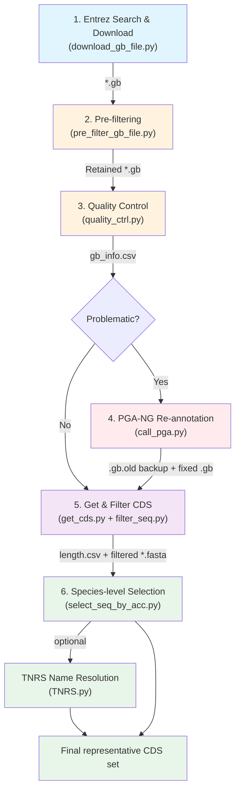
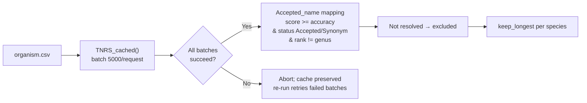

# Chloroplast Genome Mining Module

## Overview

This module implements an automated, end-to-end bioinformatics pipeline for the retrieval, quality assessment, re-annotation, gene extraction, and deduplication of plant chloroplast genome sequences from the NCBI GenBank database. The pipeline is designed for large-scale comparative chloroplast genomics studies.

---

## Pipeline Architecture

---

## Workflow Stages

### Stage 1: Entrez Search & Batch Download (`download_gb_file.py`)

**Function**: Search NCBI for chloroplast genomes by taxon names and batch-download GenBank files.

| Feature            | Description                                                                                         |
| ------------------ | --------------------------------------------------------------------------------------------------- |
| Query construction | `taxon[Organism] AND (plastid OR chloroplast) AND SLEN range`, excluding mitochondrion/chromosome |
| Threading          | `ThreadPoolExecutor` with configurable thread count (default: 10)                                 |
| Rate limiting      | Minimum 0.34 s interval between consecutive requests                                                |
| Retry              | Up to 3 retries per accession with exponential backoff                                              |
| Resume             | Detects existing`.gb` files; skips already-downloaded accessions                                  |
| Integrity          | Validates`ORIGIN` section; deletes empty/invalid files                                            |

**Inputs**: Taxon names (one per line), email, date range (optional)

**Outputs**: `{accession}.gb` files, `accession_index.txt`, `error_downloaded_index.csv`

---

### Stage 2: Pre-filtering (`pre_filter_gb_file.py`)

**Function**: Remove low-quality or non-target genomes prior to downstream analysis.

**Rejection criteria**:

| Criterion                            | Action                            |
| ------------------------------------ | --------------------------------- |
| `KEYWORDS` contains `UNVERIFIED` | Reject → rename to`.unusable`  |
| `ORGANISM` contains `sp.`        | Reject (ambiguous identification) |
| `ORGANISM` contains `x`          | Reject (hybrid)                   |

**Retention strategy**: For each taxon, retain at most `keep_latest` (default: 3) genomes, prioritized by:

1. Publication status (published > unpublished)
2. Number of annotated CDS features
3. Genome length
4. Submission date (newest first)

**Outputs**: Retained `.gb` files, `pre_filter.csv`

---

### Stage 3: Quality Control (`quality_ctrl.py`)

**Function**: Generate a quality report and flag problematic genomes.

**Metrics per genome**: `sequence_length`, `gene_count`, `CDS` (80-gene set), `tRNA`, `rRNA`, `unclear_bases`, `unclear_ratio`

**Flagging criteria**:

- CDS count < `cds_threshold` (default: 75)
- Ambiguity ratio > `ambig_threshold` (default: 0.1)

**Outputs**: `gb_info.csv`, `{accession}_reannotated.fasta` for flagged genomes

---

### Stage 4: PGA-NG Re-annotation (`call_pga.py`)

**Function**: Re-annotate problematic genomes using PGA-NG with clade-specific reference sets.

**Workflow**:

1. Identify pending genomes (skip already-annotated)
2. Copy pending FASTA to temp folder
3. Execute PGA-NG with reference genomes (Angiosperms / Gymnosperms / User-defined)
4. Monitor progress; copy results to `pga_output/`
5. Merge new FEATURES + ORIGIN into original GenBank files
6. Backup originals as `.gb.old`

**Key features**: Incremental (skips completed), graceful recovery from interruptions, multi-threaded progress monitoring.

---

### Stage 5: Get & Filter CDS (`get_cds.py` + `filter_seq.py`)

**Function**: Extract plastid CDS/rRNA genes and filter by reference length.

**Extraction** (`get_cds.py`):

- Maps features to the standard 80 plastid gene set (`PPA_80_CDS`)
- Handles split features, reverse-complement strands, alternative gene names
- Outputs one FASTA per gene + `cds_num.csv` + `length.csv`

**Filtering** (`filter_seq.py`):

$$
L_{\min} = \alpha \times L_{\text{ref}} \qquad L_{\max} = \beta \times L_{\text{ref}}
$$

Default: $\alpha = 0.5$, $\beta = 2.0$. Reference tables: `ANG_REF_LEN` (angiosperms) or `GYM_REF_LEN` (gymnosperms).

**UI integration**: Both steps are merged into a single "Get & Filter CDS" action. The intermediate extraction folder is automatically cleaned up after filtering.

**Outputs**: Filtered `{gene}.fasta` files, `length.csv`

---

### Stage 6: Species-level Selection (`select_seq_by_acc.py`)

**Function**: Select one representative chloroplast genome per species based on maximum cumulative CDS length.

**Selection criterion**: For each species, retain the accession with the greatest total CDS length.

**TNRS Name Resolution** (optional):

When enabled, organism names are standardized via the TNRS API before selection. Matches resolved only to genus level (`Accepted_name_rank == "genus"`, e.g. "Vitis sp.") are excluded, as they cannot support species-level representative selection:

| Parameter        | Description                                                                    |
| ---------------- | ------------------------------------------------------------------------------ |
| Sources          | `wcvp` (Kew WCVP) and/or `wfo` (World Flora Online); at least one required |
| Accuracy         | Minimum Overall_score threshold (default: 0.9)                                 |
| Taxonomic status | Only `Accepted` or `Synonym` matches are kept; other statuses (e.g. `No opinion`, `Unresolved`) or missing status are excluded |
| Taxonomic rank   | Matches resolved only to genus level (`Accepted_name_rank == "genus"`) are excluded; species-level resolution required |
| Batching         | 5000 names per API request; per-batch CSV cache in`tnrs_cache/`              |
| Retry            | 3 attempts per batch (pass 1) + 3 attempts (pass 2); all-fail → abort         |
| Cache validation | SHA-256 of (names + sources + accuracy); input change → auto-clear            |

**Outputs**: Representative CDS FASTA files (header: `{accession}|{species_name}`), `organism.csv`

---

## Reference Data

| Resource        | Description                                                                 |
| --------------- | --------------------------------------------------------------------------- |
| `PPA_80_CDS`  | Standard 80 plastid gene name mapping (alternative names → standard names) |
| `ANG_REF_LEN` | Reference CDS lengths for angiosperm plastid genes                          |
| `GYM_REF_LEN` | Reference CDS lengths for gymnosperm plastid genes                          |

---

## Dependencies

- Python >= 3.12
- `biopython` — sequence file I/O
- `pandas` — tabular data processing
- `PGA-NG` — chloroplast genome re-annotation (external tool, auto-installable)
- TNRS API (`https://tnrsapi.xyz`) — online name resolution (no local dependency)

---

## Authors

Yuxuan Wang, Ruijing Cheng, Xiaoting Xu
